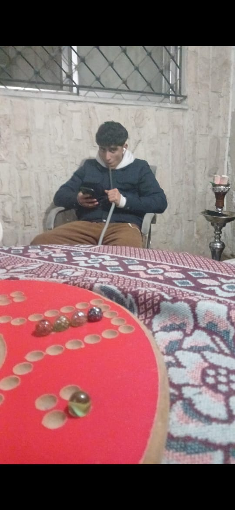
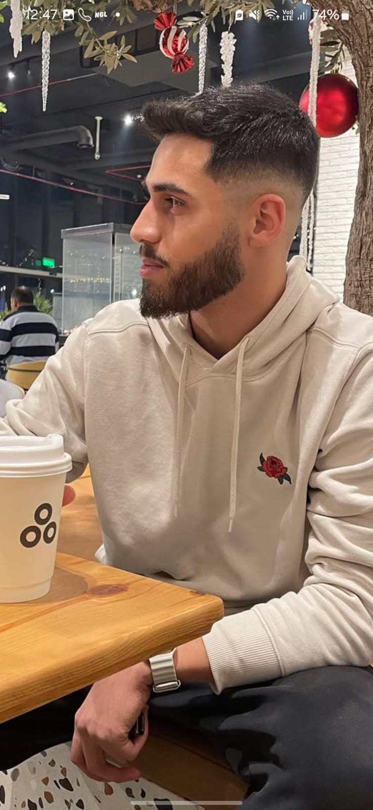
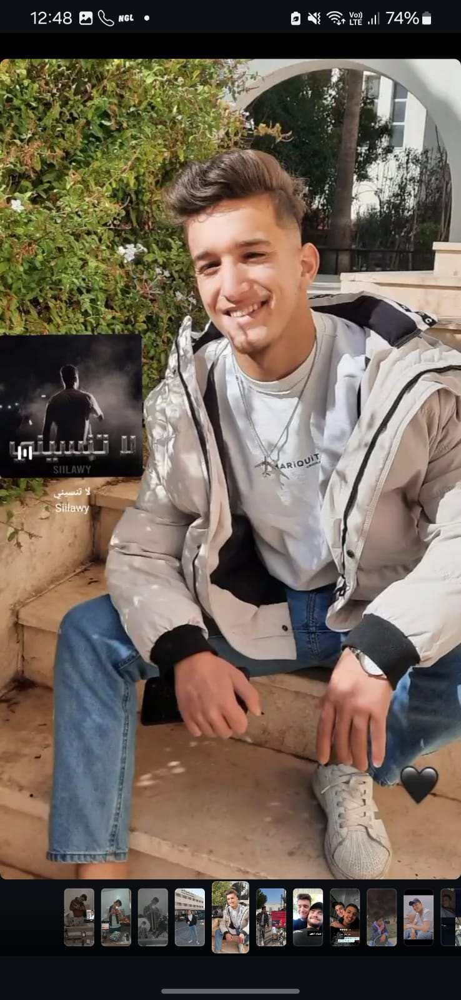

<!DOCTYPE html>
<html lang="ar" dir="rtl">
<head>
    <meta charset="UTF-8">
    <meta name="viewport" content="width=device-width, initial-scale=1.0">
    <title>مكان الكراج - أفضل مكان للعب الورق</title>
    <link href="https://cdn.jsdelivr.net/npm/bootstrap@5.3.0/dist/css/bootstrap.min.css" rel="stylesheet">
    <link href="https://cdnjs.cloudflare.com/ajax/libs/font-awesome/6.0.0/css/all.min.css" rel="stylesheet">
    <link href="https://fonts.googleapis.com/css2?family=Tajawal:wght@400;500;700&display=swap" rel="stylesheet">
    
</head>
<body>
    <!-- Navbar -->
    <nav class="navbar navbar-expand-lg navbar-dark">
        

            <a class="navbar-brand" href="#">
                <i class="fas fa-dice me-2"></i>
                مكان الكراج
            </a>
            <button class="navbar-toggler" type="button" data-bs-toggle="collapse" data-bs-target="#navbarNav">
                
            </button>
            

                <ul class="navbar-nav me-auto mb-2 mb-lg-0">
                    <li class="nav-item">
                        <a class="nav-link active" href="index.html">الرئيسية</a>
                    </li>
                    <li class="nav-item">
                        <a class="nav-link" href="players.html">احجز لاعب</a>
                    </li>
                    <li class="nav-item">
                        <a class="nav-link" href="about.html">عن المكان</a>
                    </li>
                    <li class="nav-item dropdown">
                        <a class="nav-link dropdown-toggle" href="#" id="navbarDropdown" role="button" data-bs-toggle="dropdown">
                            الألعاب
                        </a>
                        <ul class="dropdown-menu">
                            <li><a class="dropdown-item" href="#tarneeb">طرنيب</a></li>
                            <li><a class="dropdown-item" href="#trex">تركس</a></li>
                            <li><a class="dropdown-item" href="#hand">هاند</a></li>
                        </ul>
                    </li>
                </ul>
                

                    <a href="tel:+1234567890" class="btn btn-outline-light">
                        <i class="fas fa-phone me-2"></i>
                        اتصل بنا
                    </a>
                

            

        

    </nav>

    <!-- Hero Section with Garage Image -->
    <section class="hero-section text-center">
        

            

                

                    <h1 class="display-4 mb-4">استمتع بأفضل جلسات الورق</h1>
                    
العب طرنيب وتركس مع أفضل اللاعبين في أجواء مريحة مع شاي طازج 🎴

                    <a href="players.html" class="btn btn-primary btn-lg">
                        <i class="fas fa-user-friends me-2"></i>
                        احجز لاعبك المفضل
                    </a>
                

                

                    
                

            

        

    </section>

    <!-- Video Section -->
    <section class="py-5 bg-light">
        

            <h2 class="text-center mb-5">شاهد أجواء الجلسات</h2>
            

                

                    

                        <iframe src="فيديو الكراج.mp4" title="جلسات الكراج" allowfullscreen></iframe>
                    

                

            

        

    </section>

    <!-- VIP Guests Section -->
    <section class="py-5">
        

            <h2 class="text-center mb-5">ضيوف الشرف</h2>
            

                

                    

                        

                            
                        

                        

                            <h5 class="card-title">عبود زاك</h5>
                            
مقلد السيارات

                        

                    

                

                

                    

                        

                            
                        

                        

                            <h5 class="card-title">وليد شقفة</h5>
                            
لاعب جيد

                        

                    

                

                

                    

                        

                            
                        

                        

                            <h5 class="card-title">ايهم</h5>
                            
مشاهد عصبي

                        

                    

                

                

                    

                        

                            
                        

                        

                            <h5 class="card-title">مانيلا</h5>
                            
لاعب مستفز

                        

                    

                

                

                    

                        

                            
                        

                        

                            <h5 class="card-title">مازن</h5>
                            
مشاهد عكيك

                        

                    

                

                

                    

                        

                            
                        

                        

                            <h5 class="card-title">سلامة</h5>
                            
محترف هاندس

                        

                    

                

            

        

    </section>

    <!-- Features -->
    <section class="py-5 bg-light">
        

            

                

                    

                        <i class="fas fa-trophy fa-3x mb-4"></i>
                        <h3 class="h4 mb-3">لاعبين محترفين</h3>
                        
استمتع باللعب مع أفضل لاعبي الطرنيب والتركس في المنطقة

                    

                

                

                    

                        <i class="fas fa-mug-hot fa-3x mb-4"></i>
                        <h3 class="h4 mb-3">شاي طازج</h3>
                        
استمتع بأفضل أنواع الشاي الطازج خلال جلستك

                    

                

                

                    

                        <i class="fas fa-home fa-3x mb-4"></i>
                        <h3 class="h4 mb-3">أجواء مريحة</h3>
                        
مكان مريح ومجهز خصيصاً لجلسات الورق

                    

                

            

        

    </section>

    <!-- Contact Section -->
    <section class="py-5">
        

            

                <h2 class="mb-4">تواصل معنا</h2>
                

                    

                        

                            <i class="fas fa-phone fa-2x me-3"></i>
                            

                                <h5 class="mb-1">قصي نزيه - مسؤول الكراج</h5>
                                <a href="tel:+1234567890" class="text-decoration-none">+1234567890</a>
                            

                        

                        

                            <i class="fas fa-clock fa-2x me-3"></i>
                            

                                <h5 class="mb-1">أوقات العمل</h5>
                                
يومياً من 4 مساءً حتى 12 صباحاً

                            

                        

                    

                

            

        

    </section>

    <!-- Modal for Image Preview -->
    

        

            

                

                    <button type="button" class="btn-close" data-bs-dismiss="modal"></button>
                

                

                    
                

            

        

    

    <!-- Footer -->
    <footer class="text-center">
        

            
جميع الحقوق محفوظة &copy; 2025 مكان الكراج

        

    </footer>

    
    
</body>
</html>
